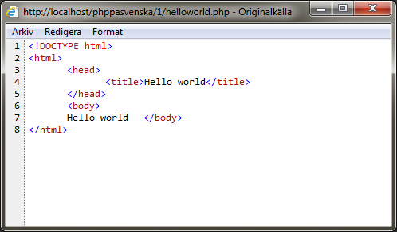

#Kapitel 1
##Hello world!
Till en början med så kommer vi inte att skriva ett objektorienterat skript. Utan vi börjar med ett klassiskt exempel för att kontrollera att du har fått igång din utvecklingsmiljö och utvecklingsserver. Vi kommer sedan att gå vidare och göra detta till synes enkla exempel objektorienterat och mer dynamiskt än vad vi började.

Alla PHP-skript bör startas med en öppnande "PHP-tagg". Då PHP kan varvas med HTML så måste vi tala om för servern att det är PHP den skall tolka. Den öppnande PHP-taggen ser ut såhär: `<?php`. Den stängs med en avslutande tagg som ser ut såhär: `?>`. Om du blandar PHP med HTML så behöver du avsluta dina PHP-sektioner för att det inte ska bli några komplikationer. Men när du skriver rena PHP-objekt så utelämnas den avslutande taggen med fördel. Anledningen till detta är för att det då garanterat inte skrivs ut något, och HTTP-huvudet skickas, innan vi vill att det ska skrivas ut något. Många fall där det blir fel beror det på att ett mellanslag eller radavbrott har skickats av misstag när ett PHP-objekt har lästs in.

Vårat första exempel är att enbart skriva ut texten "Hello world" i din webbläsare. Det görs med fördel med hjäl av den inbyggda funktionen `echo`. Det finns flera olika funktioner för att skriva ut strängar i PHP, men vi rekommenderar `echo` på grund av att den är snabbare än de andra. Börja med att skapa ett nytt PHP-dokument som du kan döpa till "helloworld.php". Skriv sedan in följande text i det dokumentet:

	<?php
		echo "Hello world";
	?>

Om du nu dubbelklickar på det dokumentet så kommer det antingen att öppnas i din webbläsare eller i din IDE (integrated development environment) beroende på hur du valt att binda filändelsen php. Öppnas det i din webbläsare så kommer det inte att se så intressant ut:

Det beror på att en webbläsare i sig inte kan tolka PHP. För att kunna se det som vi har tänkt oss (det vill säga, inte kunna se php-taggarna och php funktionerna som text) måste du titta på den via en webbserver. Om vi istället tittar på filen via en webbserver så kommer den att se ut mer som vi vill att den ska se ut:

Men, tittar vi närmare på källkoden så kan vi se att det inte är någon riktig HTML utan vi har bara fått ut texten "Hello world". Precis så som vi har det i våran php-fil. För att få en korrekt html-sida så måste vi utöka våran php-fil något. Vi börjar med att göra en sekventiell version av vårat php-skript så att vi får se en korrekt html-sida. Så vi lägger till lite html runt våran php-del som nedan:

	<!DOCTYPE html>
	<html>
		<head>
			<title>Hello world</title>
		</head>
		<body>
		<?php
			echo "Hello world";
		?>
		</body>
	</html>

Om vi nu tittar på dokumentet via en webbläsare så kommer det inte att synas några större förändringar. Men om vi tittar på källan för hemsidan så kommer det att se annorlunda ut.

Som du ser så skrivs det ut korrekt html, och som body har vårat "Hello world" skrivits ut, utan att ha `<?php` och `?>` runt sig.

##Dags för objektorientering
Vi börjar nu med att göra vårat första PHP-objekt. Det kommer att vara ett enkelt exempel där vi inte använder någon nämnvärd mjukvaruarkitektur. Så vi kommer att nyttja sekventiell php för att skriva ut våran text, men objekt för att seperera funktionalitet ifrån HTML. Så vi utökar vårat php-skript genom att skapa ett php-objekt under våran html.

	<?php
		class HelloWorld {
			public function printMessage() {
				echo "Hello world";
			}
		}
	?>

I html notationen så instansierar vi nu istället ett objekt av typen "HelloWorld" och ropar på funktionen "printMessage" så i helhet kommer vårat exempel nu att se ut såhär:

	<!DOCTYPE html>
	<html>
		<head>
			<title>Hello world</title>
		</head>
		<body>
		<?php
			$helloWorld = new HelloWorld();
			$helloWorld->printMessage();
		?>
		</body>
	</html>

	<?php
		class HelloWorld {
			public function printMessage() {
				echo "Hello world";
			}
		}
	?>

Du noterar nog säkert att jag har använt en variabel. Variabler i php deklareras med hjälp av att inleda namnet med ett dollartecken (__$__). Du märkte även att jag inte angav någon typ på variabeln. Det beror på att PHP är ett så kallat otypat språk. Det innebär att du inte behöver ange vilken typ din variabel är, och den kan innehålla både textsträngar, heltal, objekt eller liknande. Du ser även att jag anropar funtionen `printMessage()` genom en pil (__->__) och inte en punkt (**.**) som i många andra språk.

##Upprätta en arkitektur
En del programmerare kan hävda att PHP är osäkert och bör inte användas på grund av detta. Detta är något av en myt. PHP är varken säkrare eller mindre säkert än övriga språk som finns där ute. En av de sakerna som kan vara anledningen till denna myt är att det är ett extremt populärt språk som är enkelt att lära sig. Det innebär att det finns väldigt många applikationer som använder sig av PHP. Vilket i sin tur leder till att det finns ett större utbud av applikationer där missöden kan ha inträffat. Det samma gäller att PHP är billigt att driftsätta och har funnits sedan 1995, vilket gör att i början av PHPs varande så var det inte det säkraste språket som fanns. Men språket i sig var egentligen inte problemet. PHP är precis som alla andra webbapplikationer inte säkrare än den servern som huserar det. PHP har däremot en nackdel som exempelvis ASP.NET eller JSP inte har. Det saknar ett ramverk och kompilering där det finns inbyggda felsäkringar eller valideringar. Därför är det av stor vikt när du programmerar PHP applikationer att du använder dig av en stabil mjukvaruarkitektur, och framförallt håller dig till denna arkitektur. I denna bok kommer vi att använda oss av mjukvaruarkitekturen Model View Controller (__MVC__).

För att börja upprätta denna arkitektur så skapar vi nu tre mappar i rooten på vårat nya projekt. Vi kallar dessa för "model", "view", och "controller". Vi skapar sedan i katalogen som heter "model" en fil som vi kallar för "helloworldmodel.php". I katalogen som heter view skapar vi en fil som vi namnger "helloworldview.php", och i katalogen "controller" skapar vi filen "helloworldcontroller.php". Vi tar även bort helloworld.php i rooten och skapar filen "index.php" istället.

Vi börjar med att skapa modellen för våran applikation. Så då öppnar vi filen "helloworldmodel.php". Vi kommer i denna fil nu både ha en klass med ett namespace och den funktionalitet som avgör vad för något som applikationen ska kunna göra som vi inte vill att användaren direkt ska kunna påverka. Så i filen skriver vi denna källkod:

	<?php
	
	namespace HelloWorld\Model;
	
	class HelloWorldModel {
		private $m_message = "Hello World";
			
		public function getMessage() {
			return $this->m_message;
		}
	}

Som du säkert noterat så är namespace definerat som `HelloWorld\Model` och inte `HelloWorld.Model` som i exempelvis Java eller C#. Det är något som helt enkelt är definerat som standard i PHP att använda backslash (__\\__) istället för punkt (**.**) i namespace definitionen. Något annat som du noterat är att det står m_ framför den privata medlemsvariabeln message. Detta är något som kallas för hungarian notation där m_ helt enkelt visar att detta är en medlemsvariabel. Det är något som kommer att användas konsekvent i denna bok för att visa saker så som medlemsvariabler. I övrigt borde inte denna klass innehålla något som är nytt för dig som läsare. Det är en klass med en privat medlemsvariabel som innehåller strängen "Hello World". Vi har sedan funktionen `getMessage` som returnerar det värde som finns i medlemsvariabeln `$m_message`.